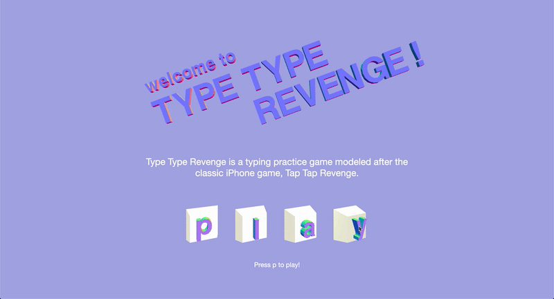
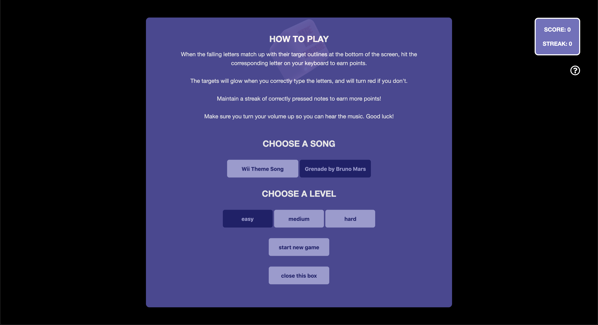
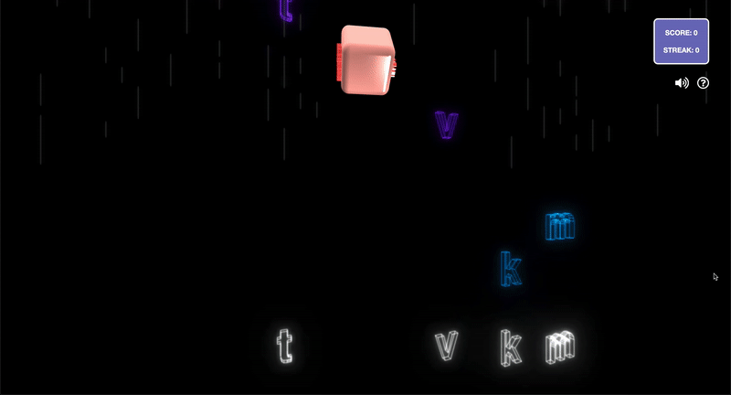
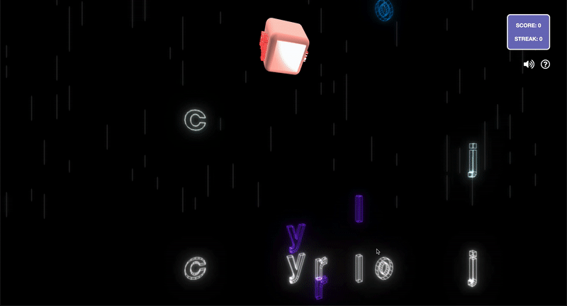
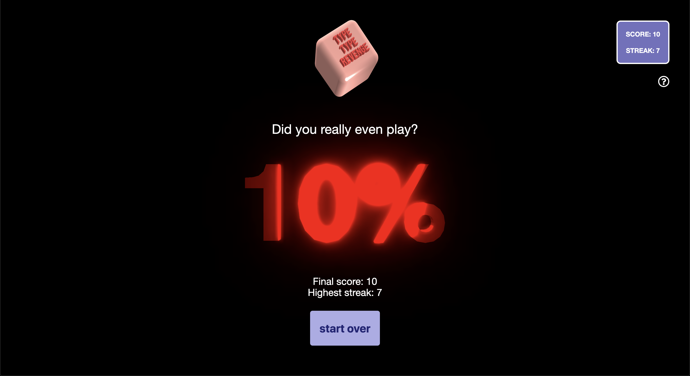
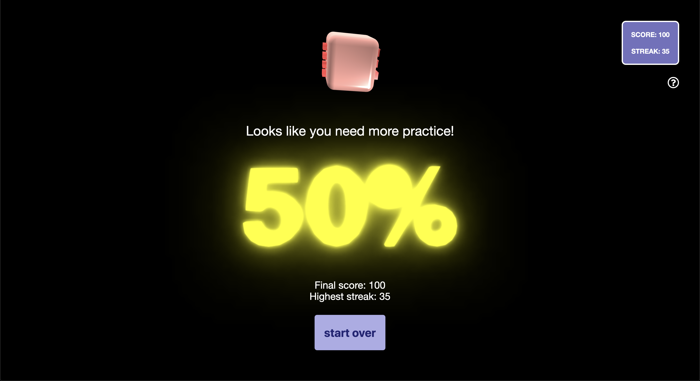
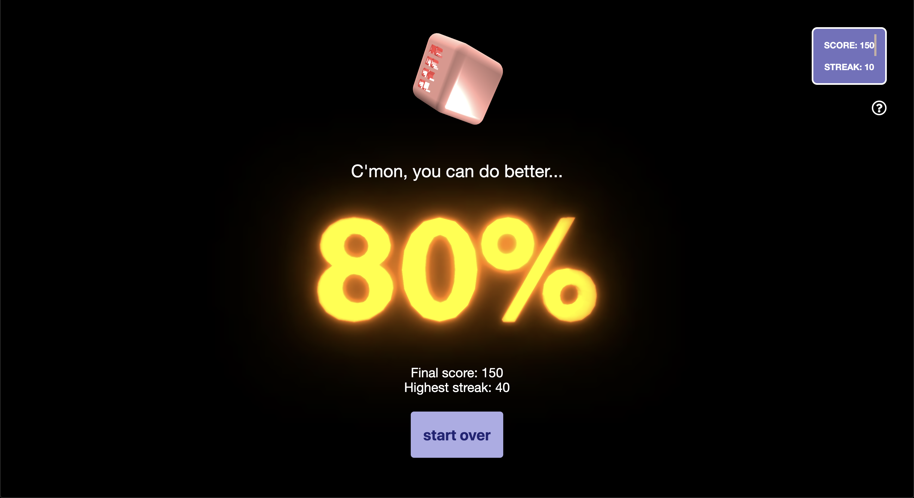
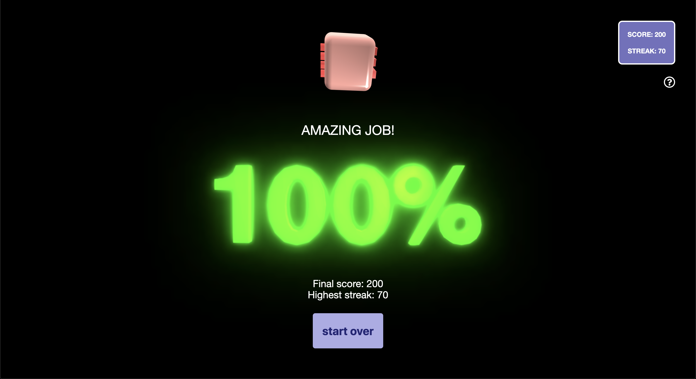

# Welcome to Type Type Revenge!

Type Type Revenge is a 3D web game built with Three.js to provide an interactive environment for users of various typing levels to practice their typing skills. It is inspired by the classic iPhone game Tap Tap Revenge, as well as popular videogames Guitar Hero and Dance Dance Revolution.

[Live Demo](https://belle-chang.github.io/type-type-revenge)

## Demo of Features
### Introduction Page

### Instructions Bar

### Letter Effects
#### Correctly Typed Letter

#### Missed Letter

#### Incorrectly Typed Letter

### Scoring Effects
#### Low Scores

#### Medium Scores

#### Medium to High Scores

#### High Scores

<!-- ## Setting Up Your Project
Before you start your project, look inside `package.json`. Take a note of the following fields, and adjust them where appropriate:

* `name`: This is your project name as it would appear on the npm registry (if published). You should replace this with your own project name, but make sure to preserve the all lowercase and hyphenated format.

* `repository`: This should hold the name of your repository for this project. It should match name of your GitHub repository as it appears in the URL. For instance, "https://github.com/ReillyBova/three-seed" would become "three-seed".

* `version`: This field is used to version your project. The standard format for these is "MAJOR.MINOR.PATCH". You can update this as needed (for instance, setting it to "1.0.0" when you are finished with the project), or you can choose to ignore it.

* `title`: This field contains the "pretty" name of your project. When you run your project in the browser, this title will be injected into the site's HTML header. Most browsers will use this to label the browser tab.

* `description`: A really quick description of your project.

* `keywords`: A list of keywords for you project. Feel free to modify as needed, note that the last keyword should **not** be followed by a comma, since `package.json` must adhere to JSON format.

* `scripts`: This field contains several npm scripts that you will find useful. The first three commands (`start`, `prebuild`, and `build`) are used to build the development webserver, as well as the production bundle, for your project. `format` is used to "prettify" your JavaScript into a standardized format, as specified in `.prettierrc`. Finally, `deploy` is used to publish your project to GitHub Pages as a live demo. You can run any of these commands from the command line using `npm run <script-name>`.

The dependencies below these fields tell npm what libraries (and more specifically, which versions of these libraries) to download when you run `npm install`. If there are further packages you would like to add to your project, you can install them by running `npm install <package-name>`.

## Launching a Local Webserver
Now that your development environment is ready to go, you can spin up a local development webserver using `npm start`. This command will bundle the project code and start a development server at [http://localhost:8080/](http://localhost:8080/). Visit this in your web browser; every time you make changes to the code, *the page will automatically refresh.* If you did everything correctly, you should see something that looks like [this](https://reillybova.github.io/three-seed/) in your browser. Congratulations --- now you are ready to work!

## Editing the Code
The first file you should open is `./src/app.js`. This includes the setup for your ThreeJS scene, as well important global-level operations like the render loop. At the top of the file, you will see modular imports for objects from the ThreeJS library dependency, as well as from the local project directory.

Next, navigate to `.src/components/scenes/SeedScene.js`. This file contains the definition for the class `SeedScene`, and the sets this class as the default export. The companion file `.src/components/scenes/index.js` then takes this default export and makes it visible as `SeedScene` to any files importing from the `scenes` folder. Note that if you want to add additional folders to the `.src/components` subdirectory, you will probably want to add `import` aliases (shortcuts) for these new folders in `webpack.config.js`.

Returning our focus to `SeedScene.js`, first take a look at the constructor. The call `super()` invokes the parent constructor for the class, which is `Scene()` here. Then we add an instance variable called `state`, and populate it with some default settings. One of these initialization, `new Dat.GUI()`, will create a simple user interface that should already be familiar to you. You can [learn more about dat.GUI here](https://workshop.chromeexperiments.com/examples/gui/#1--Basic-Usage), or you can uninstall it from the project via `npm uninstall dat.gui`.

The next primary line after `this.state = ...` is not creating a new instance variable, but is rather modifying the `background` instance variable that was initialized in the `Scene` constructor (invoked by `super()`). Setting this property will changes the current color of the scene's background. Try changing this property to `0xff0000`, and see what happens to your pretty scene in the browser!

After (re)setting the background to a nice sky blue, we next initialize and insert a few objects into the scene. Finally, at the end of the constructor, we tell the dat.GUI user interface to add a slider for the "rotationSpeed" property of `this.state`. The dat.GUI instance will automatically update `this.state.rotationSpeed` to whatever the user sets it to via the interface.

Real quickly, another interesting function in the `SeedScene` class is `update()`. If you  return to `app.js`, you will see that we invoke this function via `scene.update()` in the render loop. Be careful to understand what we are doing within `update()` and how this affects the dynamic behavior on the screen.

Once you understand the `SeedScene` class, the next place to look is `./src/components/objects/Flower/Flower.js`. Overall, this `Flower` class is fairly similar to `SeedScene`, but watch out for a few key differences: first, `Flower` extends `Group`, not `Scene`; second, the `Flower` constructor takes an argument, which is used to reference the `gui` property of the parent (`SeedScene` here). Finally, for a more advanced animation example, check out the `spin()` function to see how we time the flower's jump using TweenJS.

Note that if you want to add your own object folder withing the `objects` directory, you will need to edit `objects/index.js`.

## Importing Local Files
Local files, such as images and 3D models, are imported into the application as URLs then loaded asynchronously with ThreeJS. Most common files that ThreeJS uses are supported out of the box. Shader files are loaded as raw text. For more information about this system, as well as for instruction on how to add additional loaders, see the [webpack site](https://webpack.js.org/).

## Importing Modules from the Web
As mentioned above, if you want to add additional functionality to your project, you can search for packages and install them from the [npm repository](https://www.npmjs.com/).

## Building the Project for the Web
Once you are happy with your project, try building a production bundle using `npm run build`. This will place an optimized and minified executable version of your project in the `./build/` directory. Test out this production build by setting `./build/` as your working directory and starting out a python server.

Once you have a working production build and are ready for the site to go live, you can deploy your project straight to GitHub Pages via `npm run deploy`. Note that this requires that (1) your project is part of a repository, and (2) you have correctly set up your project's `package.json` file.

## CC Attributes
Both models were downloaded from the Google Poly project:

* [Floating island](https://poly.google.com/view/eEz9hdknXOi)

* [Flower](https://poly.google.com/view/eydI4__jXpi) -->

## License
[MIT](./LICENSE)
